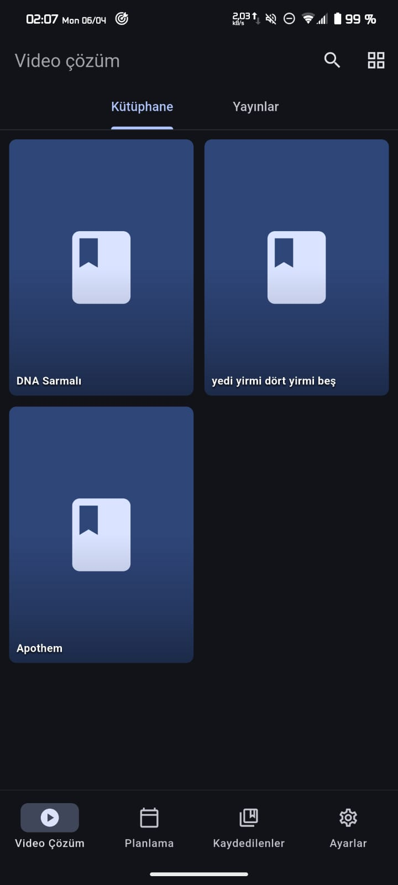
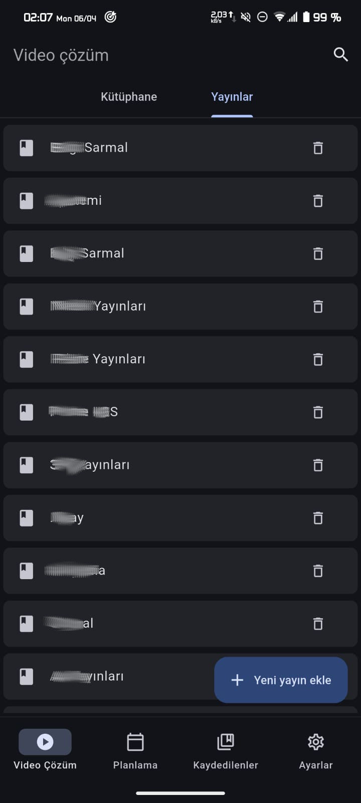
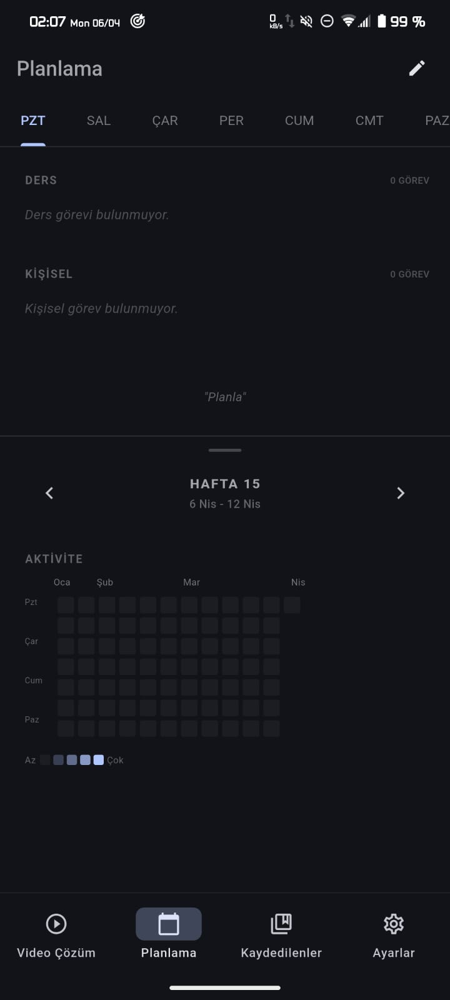
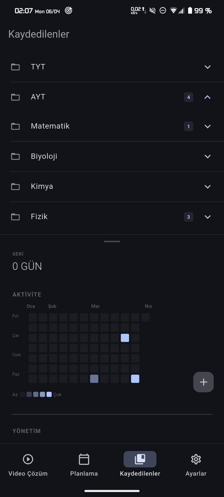
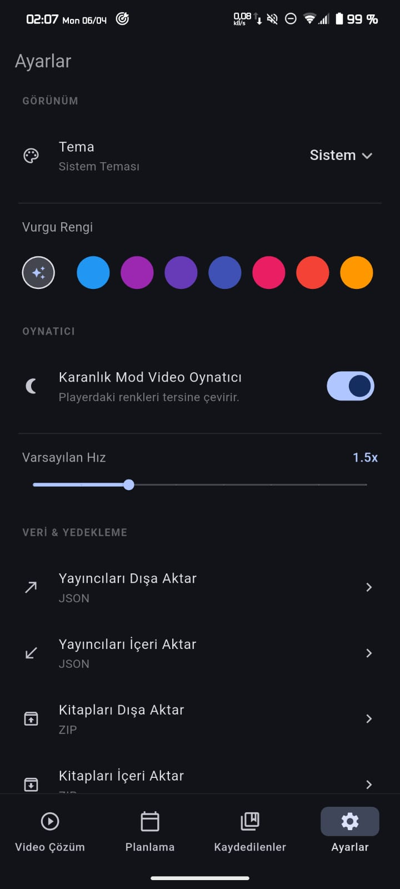

# Derspp

Derspp, Flutter ile geliştirilmiş, eğitim içeriklerini merkezi bir yapıda toplayan ve vektörlü video başta olmak üzere video çözüm oynatma özelliklerine sahip açık kaynaklı bir uygulamadır. Uygulama başta farklı kaynaklardan gelen eğitim materyallerini organize etmek amacı ile yapılmış olsa da öğrencilerin işine yarayabilecek bir çok özellik barındırmaktadır.

## Özellikler

- Çoklu platform desteği.
- Çoklu yayıncı entegrasyonu ve kişisel kütüphane yönetimi.
- Vektör tabanlı animasyon ve senkronize çizim oynatma motoru.
- MP4 ve vektörel formatlı soru çözüm desteği.
- Gelişmiş rutin ve görev planlama sistemi.
- Çalışma performansını gösteren görsel aktivite haritası.
- Kaydedilen sorular için arşiv ve aralıklı tekrar inceleme arayüzü.
- Karanlık ve aydınlık mod desteği.

## Ekran Görüntüleri

| | | |
| :---: | :---: | :---: |
|  |  |  |
|  |  | |

## Proje Yapısı

- lib/database/: Yerel veri depolama ve senkronizasyon işlemlerini yönetir.
- lib/models/: İçerik, soru ve çizim öğeleri için yapılandırılmış veri modellerini içerir.
- lib/providers/: Kütüphane verileri, görevler ve temalar için durum yönetimi (state management) mantığını barındırır.
- lib/services/: Ağ işlemleri, XML işleme ve içerik keşfi için temel mantığı sağlar.
- lib/ui/: Modüler ekran uygulamaları ve özel bileşen tasarımlarını içerir.


## Kurulum
Uygulamayı buradan indirebilirsiniz

Uygulamanın çalıştığını bildiğim platformlar şunlardır: 
- Android
- Linux
- Web

Web versiyonunda tarayıcı CORS politikaları gereği direkt olarak html parsing yapılamamaktadır

## Derleme adımları
Proje Flutter 3.38.6 Dart 3.10.7 sürümlerinde test edilmiştir lütfen uygulamayı tavsiye ettiğim bu sürümlerde derleyin.

1. Bağımlılıkları yükleyin:
   ```bash
   flutter pub get
   ```

2. İstediğiniz platform için uygulamayı derleyin:
   ```bash
   flutter build apk
   ```

## Lisans
Proje AGPL-3.0 ile lisanslanmıştır lisansın tamamını görmek için LICENCE.md dosyasına bakınız.