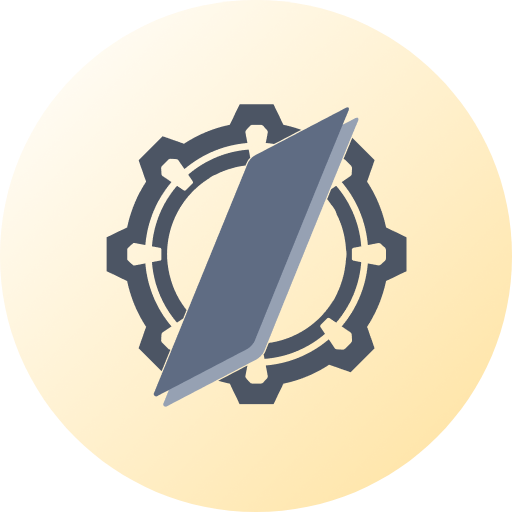

<div align="center">
    
    <h1><b>derspp</b></h1>
    <p>
        <a href="https://github.com/navidicted/derspp/blob/main/LICENSE"></a>
        <a href="https://github.com/navidicted/derspp/stargazers"></a>
        </a>
    </p>
    <p>
        <a href="docs/usage.md"><b>Dokümantasyon</b></a> •
        <a href="docs/installation.md"><b>Kurulum</b></a> •
        <a href="#özellikler"><b>Özellikler</b></a> •
        <a href="#ekran-görüntüleri"><b>Ekran Görüntüleri</b></a>
    </p>
</div>
Derspp, flutter ile geliştirilen; kullanıcıların soru çözüm oynatma, soru çözümlerini kaydetme, kaydedilen soruları aralıklı tekrarlama, görev listesi hazırlama imkanı sunan bir uygulamadır.

## Özellikler

- Nerdeyeyse tüm yayınlar için soru çözümü oynatma desteği.
- Rutin ve görev planlama sistemi.
- Çalışma performansını gösteren görsel aktivite haritası.
- Soru kaydetme özelliği ve aralıklı tekrarlama sistemi.
- Oynatıcı karanlık ve aydınlık mod desteği.

## Ekran Görüntüleri

| | | |
| :---: | :---: | :---: |
|  |  |  |
|  |  | |

## Kurulum
Uygulamayı buradan indirebilirsiniz

Uygulamanın çalıştığını bildiğim platformlar şunlardır: 
- Android
- Linux
- Web(?) 
Web versiyonunda proxy gereklidir

## Nasıl kullanılır
Kullanma dokümantasynuna buradan ulaşabilirsiniz.
## Derleme adımları
Proje Flutter 3.38.6 Dart 3.10.7 sürümlerinde test edilmiştir. Bu sürümlerin kullanılması tavsiye edilir.

1. Bağımlılıkları yükleyin:
   ```bash
   flutter pub get
   ```

2. İstediğiniz platform için uygulamayı derleyin:
   ```bash
   flutter build apk
   ```

## Uygulama hakkında
<details>
  <summary><b>Uygulama ne amaçla ortaya çıktı?</b></summary>
  Uygulama ders kitaplarının soru çözümlerinin kapak fotoğraflarının kişiselleştirilebilir anime kızı koyma motivasyonuyla ortaya çıktı. Tabii ki bir telefonda tek bir soru çözüm uygulaması falan...
</details>

<details>
  <summary><b>Uygulamayı nasıl kullanırım?</b></summary>
  Uygulama kullanım klavuzuna buradan erişebilirsiniz.
</details>

<details>
  <summary><b>derspp adı nereden geliyor</b></summary>
  Ders ve app adlarının birleştirilmiş hali.
</details>

<details>
  <summary><b>Uygulama logosunun anlamı ne?</b></summary>
  Bir çark ikonu ve üstünde duran kitap -kitaba benzetmek için hayal gücünüzü kullanabilirsiniz.
</details>

## Teşekkürler

 Son olarak uygulamayı erkenden deneyip bana motivasyon veren arkadaşlarıma teşekkür ederim.

## Lisans
Proje AGPL-3.0 ile lisanslanmıştır lisansın tamamını görmek için LICENCE.md dosyasına bakınız.